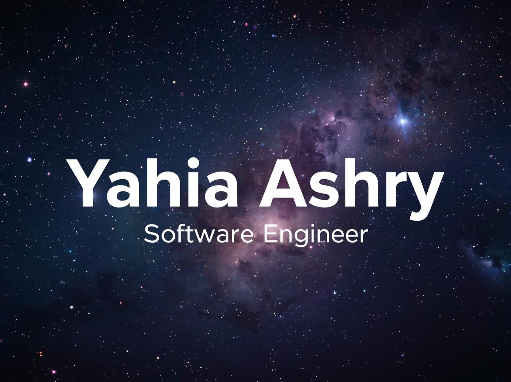

# Yahia Ashry

**Software Engineer** | Full-stack Developer | Building products that work

Full-stack developer focused on clean code, strong UI, and practical problem-solving. I build web apps, mobile apps, automation tools, and data-driven systems.

· [LinkedIn](https://www.linkedin.com/in/yahia-ashry-8b4472313/) · [Email](mailto:Yahia.ashryy@gmail.com)

---

## 🛠️ Tech Stack

### Languages

### Frontend

### Backend & Frameworks

### Data & ML

### Databases

### Tools & Infra

---

## 🚀 Featured Projects

### EasySpend — Smart Budget Tracker

Mobile budget tracker with live spending updates and category analytics.

- **Stack:** Flutter, Supabase, PostgreSQL, BLoC
- **Features:** Real-time budget tracking, alerts at thresholds, spending charts
- [View Project](https://easy-spend-123.web.app/)

### RecruiterPro — Hiring Workflow Platform

Hiring pipeline management with AI-assisted candidate screening.

- **Stack:** React, Node.js, TypeScript, MongoDB, OpenAI API
- **Features:** Resume parsing, interview scheduling, candidate ranking
- [View on GitHub](https://github.com/Yahiaashry/Recruiter-Pro)

### OS System Metrics Monitor

System monitoring tool for CPU, memory, disk, and network health.

- **Stack:** Python, Linux, DevOps
- **Features:** Live metrics, historical trends, threshold alerts
- [View on GitHub](https://github.com/Yahiaashry/Os_System_metrics)

### AlgoLab — Machine Learning Web App

No-code dataset analysis with built-in ML workflows.

- **Stack:** Python, Flask, scikit-learn, Matplotlib, Seaborn
- **Features:** Regression & clustering, auto preprocessing, visual outputs
- [View on GitHub](https://github.com/Yahiaashry/AlgoLab)

---

## 📊 GitHub Stats

---

## 📫 Let's Connect

---

**Built with Next.js, TypeScript, and focus on clean product thinking.**

